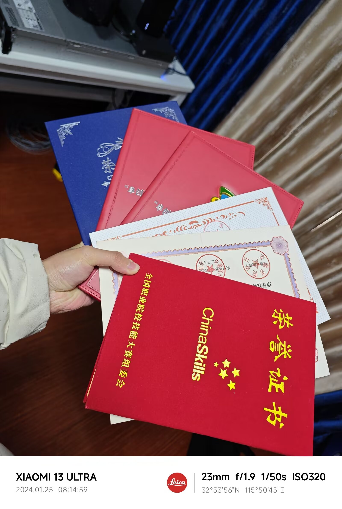
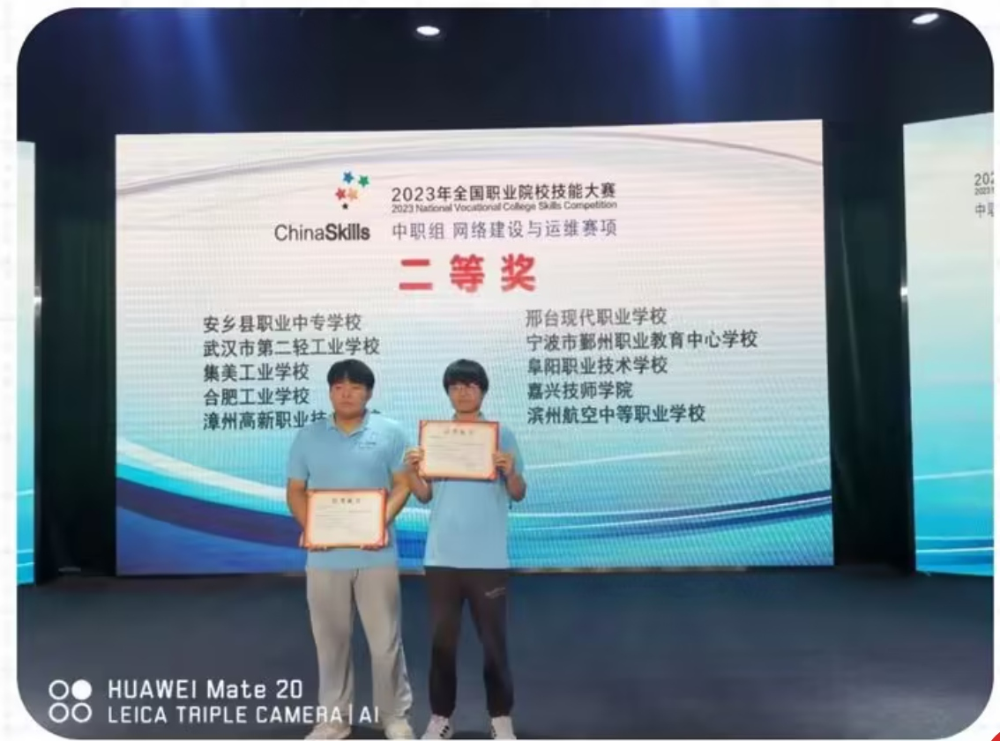
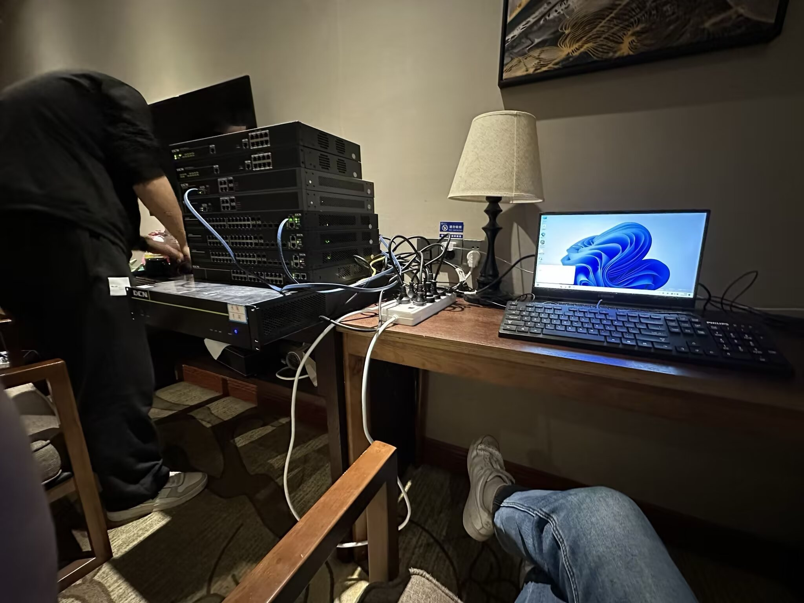
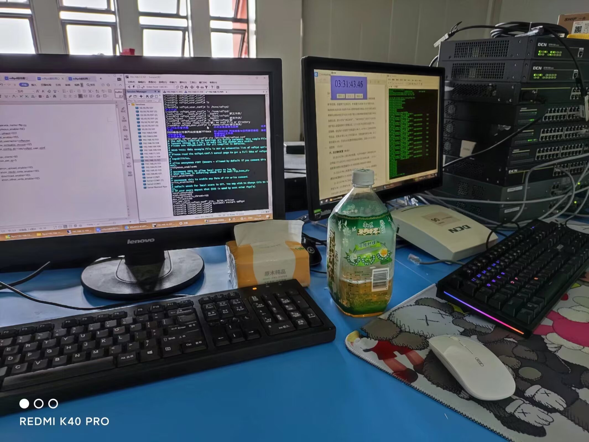
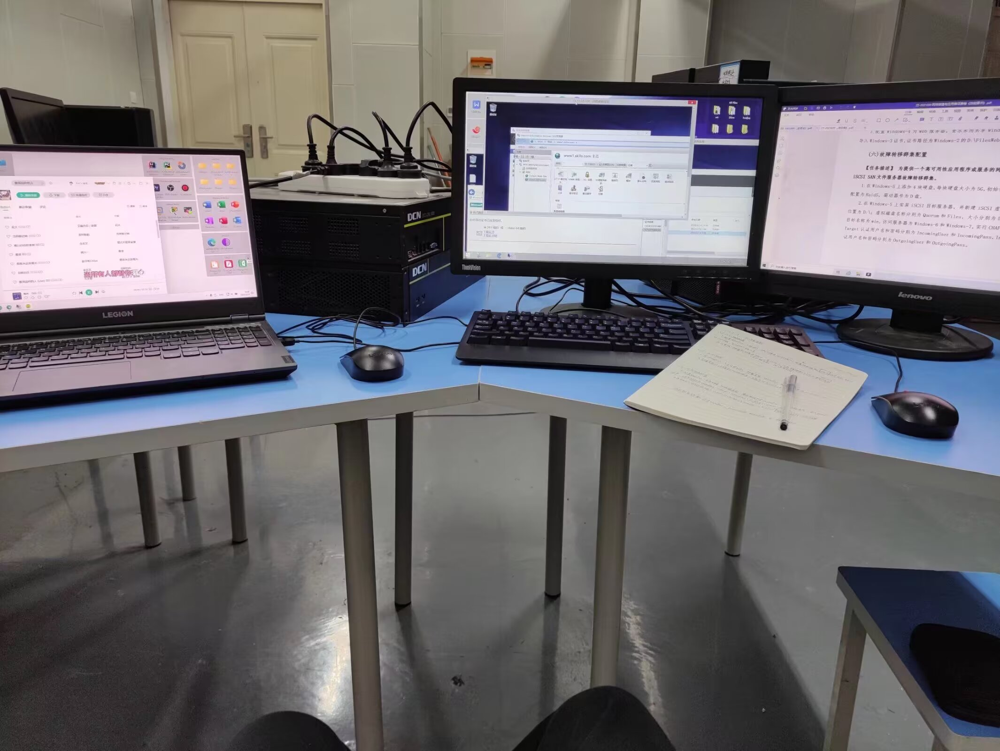

# **Hello! Nice to meet you 👋**

I'm EggFine 🌟, hailing from Fuyang city in Anhui province, China 🇨🇳. My programming journey began at the age of 7 when I first encountered E Programming Language and started developing projects 👨‍💻. As I delved deeper into my studies, my skill set expanded to encompass multiple domains:

🎬 Video Editing: Proficient in Premiere Pro 

🎨 Graphic Design: Skilled in CorelDRAW 

🖥️ System Operations: Extensive experience with both Windows and Linux systems

I'm well-versed in operating systems ranging from Windows XP to Windows 11, and Windows Server 2003 to 2025. On the Linux side, I'm proficient in CentOS 7 to Stream 9, Rocky 8 to 9, and Ubuntu 22 to 23. My expertise covers a wide array of network services and technologies, including but not limited to:

🔧 Web Servers: IIS, Apache, Nginx 

🗄️ File Services: Vsftp, Samba, FTP, WebDAV

🐳 Containerization: Docker 

🖧 Network Services: DNS, DHCP, NFS, iSCSI 

🔐 Security Technologies: Firewall configuration, Redis security 

💾 Storage Technologies: Disk arrays, Volume Shadow Copy 

🖥️ Virtualization: Qemu, Virtinst, OpenStack

In the realm of network security, I've mastered various penetration testing techniques: 

🔓 SQL injection 

🔑 Weak password cracking 

🕸️ XSS (Cross-Site Scripting) 

🕵️ Packet analysis using Burp Suite 

🐚 Proficient use of various WebShell tools (like China Chopper, AntSword)

As a tech enthusiast, I'm also passionate about mobile device customization. I've used root tools and frameworks like SuperSU (in the early days), Xposed, LSPosed, KernelSU, and Magisk. During the more open periods of Android systems, I experimented with various third-party ROMs such as Mokee and CyanogenMod (CM).

My programming skills span multiple languages and frameworks: 

 C, Java, E Programming Language and its ExUI UI framework, Python, Flutter + Dart

Throughout my academic and professional journey, I've been fortunate to achieve several notable accomplishments 🏆:

- 🥇 First place and first-class award in the Fuyang "Fu Chuang Hui" Vocational School Skills Competition for two consecutive years (2020-2021 and 2022-2023)
- 🏅 9th place in the Anhui Province selection for the 2022 BRICS and Belt and Road Initiative Vocational Skills Competition (Information Security)
- 🥇 First place and first-class award in the 2022-2023 Anhui Province "Bank of China Cup" Vocational School Skills Competition
- 🥇 First place in the 2023 China Skills Anhui Province selection competition
- 🥈 Second-class award in the 2023 China Skills national competition

Beyond my professional skills, I have numerous personal interests 🎮. I'm passionate about Minecraft ⛏️ and enjoy other single-player games like Arknights 🎭 and Cyberpunk 2077 🌆. These games not only provide entertainment but also inspire my creativity and technical innovation 💡.

Currently, I'm focusing on developing plugins for Minecraft 🧩, primarily based on the Spigot and Folia APIs. If you're interested in my work, feel free to check out my projects on the SpigotMC platform 🔍.

In addition to my technical explorations, I've also embarked on an entrepreneurial journey. I've founded a company in Fuyang called Fuyang Blbilink Co., Ltd. 🏢. This company serves as a platform for me to transform my passion for technology into practical business applications, and I hope to contribute to the local technological development through it.

I firmly believe that technology has the power to change the world 🌍, and I aspire to contribute to this ever-evolving digital landscape through continuous learning, innovation, and entrepreneurship 🚀.

